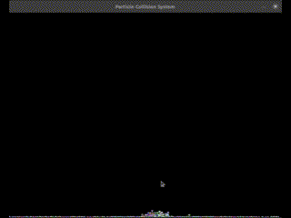

# Sistema de Partículas com Colisões e Gravidade Dinâmica

 *(Inclua um GIF/screenshot da simulação em ação)*

Um simulador de partículas interativo onde partículas são influenciadas pela gravidade do mouse e colidem entre si, desenvolvido em Python com Pygame.

## 📋 Descrição

Este projeto cria um sistema dinâmico de partículas com as seguintes características:
- Partículas interagem com o movimento do mouse (campo gravitacional)
- Colisões físicas realistas entre partículas
- Comportamento elástico nos limites da tela
- Customização fácil de parâmetros físicos e visuais

## ✨ Funcionalidades

- **Gravidade Dinâmica**: Partículas são atraídas/repelem pelo cursor do mouse
- **Colisões Realistas**: Partículas não se sobrepõem e transferem momentum
- **Física Configurável**: Ajuste de gravidade, elasticidade, amortecimento e mais
- **Visualização Clara**: Cores aleatórias e tamanho uniforme para melhor visualização
- **Eficiência**: Otimizado para desempenho com cálculos vetoriais

## 🛠 Requisitos

- Python 3.10+
- Pygame 2.5+
- Bibliotecas padrão do Python

## ⚙ Instalação

1. Clone o repositório:
```bash
git clone https://github.com/GustavoGarciaPereira/particle-system.git
cd particle-system
```

2. Instale as dependências:
```bash
pip install pygame
```

## 🎮 Como Usar

Execute o programa com:
```bash
python main.py
```

**Controles:**
- Movimente o mouse para atrair as partículas
- Botão esquerdo do mouse: Cria novas partículas na posição do cursor
- Tecla `R`: Alterna entre atração e repulsão *(opcional)*
- Tecla `Espaço`: Pausa/retoma a simulação *(opcional)*

## ⚖ Configuração

Ajuste os parâmetros no código (`main.py`):

```python
# Configurações principais
WIDTH, HEIGHT = 800, 600            # Tamanho da janela
PARTICLE_COUNT = 150                # Número de partículas
GRAVITY_STRENGTH = 1200             # Força da gravidade do mouse
BASE_GRAVITY = Vector2(0, 0.5)      # Gravidade constante
DAMPING = 0.98                      # Amortecimento de movimento (0-1)
BOUNCE = -0.8                       # Elasticidade nas bordas (-1 a 1)
PARTICLE_SIZE = 3                   # Tamanho visual das partículas
MIN_DISTANCE = 2 * PARTICLE_SIZE    # Distância mínima entre partículas
```

## 📌 Observações

- A performance pode variar dependendo do número de partículas
- Colisões usam detecção O(n²) - ideal para até 300 partículas
- Sistema otimizado para demonstração visual, não para precisão física absoluta

## 📄 Licença

Este projeto está licenciado sob a Licença MIT - veja o arquivo [LICENSE](LICENSE) para detalhes.
